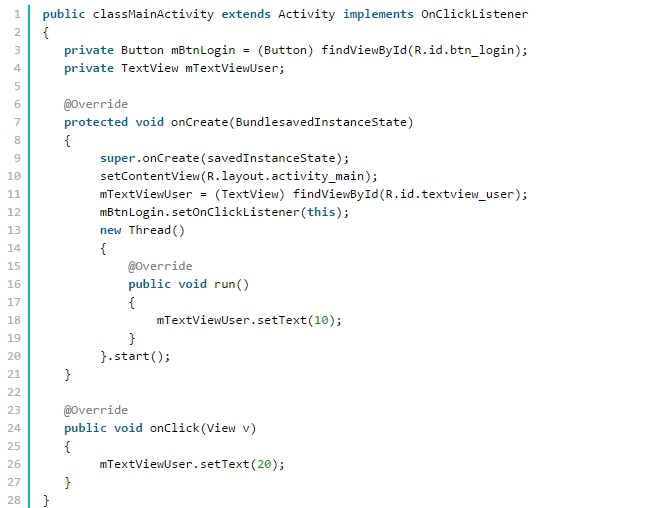

**考试要求**：

**1.时间为早上9:30分到晚上19点30分**

**2.请在答题纸上写上 项目名称（例如Android06）和姓名**

**3.答题时请注明题号，题号在前，填写的答案在后。对题目有疑问，可在题号后注明，随着答题纸一并提交。**

**4.所有题目都是选择，所有题目至少有一个是正确的，少选，错选，多选都没有分数，答对1题，得1分，一共100道题目，满分100分，及格85分**

**5.考试形式为开卷，可以上网查询资料，可以翻阅书籍，可以自己编写代码测试，杜绝抄写，杜绝讨论，可以适当的相互之间讨论题目的含义，以明确题目的含义，但是不得咨询他人的答案。**

**6.考试期间，不允许打游戏（包括手游），不允许看与Android和java无关的视频，监考人员发现一次，立即拍照一次，考试成绩减去1分。**

**7.考虑到考试时间较长，考试人员可以带着耳机听音乐，可到考场外面接打电话，可以喝水，吃零食，前提是不得影响周围人的答题。**


1.关于intent的说法，错误的是?

​	A.可以用来激活一些组件

​	B.表示程序想做某些事的意图

​	C.只能用于一个组件内部

​	D.是一个简单的消息对象

2.为满足线程间通信，Android提供了？

​	A.Handler和Looper

​	B.Handler

​	C.Message Queue

​	D.Looper

3.下列哪一项不是Android的动画类型

​	A.Tween

​	B.Alpha

​	C.Frame

​	D.Animation

4.Intent intent = new Intent(Intent.ACTION.VIEW,Uri.parse("http://mail.google.com"))这句话作用陈述正确的是( ).

​	A.发送emal

​	B.在浏览器浏览这个网址

​	C.发动短信

​	D.其他项都不正确

5.layout中创建的.xml 起名范围

​	A.(a~z)(0~9)(_.)

​	B.(a~z)(0~9)(|><)

​	C.(a~z)(0~9)

​	D.(a~z)(_.)

6.关于Intent对象说法错误的是()

​	A.在Android中，Intent对象是用来传递信息的

​	B.Intent对象可以把值传递给广播或Activity

​	C.利用Intent 传值时,可以传递一部分值类型

​	D.利用Intent传值时,它的key值可以是对象

7.关于 Handler 的说话正确的是(）

​	A.它实现不同线程间通信的一种机制

​	B.它避免了新线程操作UI组件

​	C.它采用栈的方式来组织任务的

​	D.它可以属于一个新的线程

8.下列不属于android布局的是？

​	A.FrameLayout

​	B.LinearLayout

​	C.BorderLayout

​	D.TableLayout

​	E.RelativeLayout

9.关于AlertDialog描述错误的是( ).

​	A.show()	方法创建并显示对话框

​	B.AlertDialog().Builder的create() 和show()方法都返回AlertDialog对象

​	C.AlertDialog()不能用new关键字构件对象,而必须使用其内部类的Builder

​	D.create()方法创建并显示对话框

10.如果在android应用程序中需要发送短信,那么需要在AndroidManifest.xml文件中增加什么样的权限( ).

​	A.不用配置

​	B.permission.SMS

​	C.android.permission.RECEIVE_SMS

​	D.android.permission.SME_SEND

11.在Android中使用RadioButton时,要想实现互斥的选择需要用的组件是

​	A.ButtonGroup

​	B.RadioButtons

​	C.CheckBox

​	D.RadioGroup

12.RemoteView在哪里功能中使用

​	A.Toast

​	B.AppWidget

​	C.ListView

​	D.Notification

13.下面关于数据持久化的描述正确的有

​	A.在内存中缓存多个BitMap对象时一种数据持久化方法

​	B.SQLite数据库文件可以保存在SD卡中

​	C.ContentProvider的主要目的是为了将Android应用的数据持久化

​	D.数据的持久化就是将内存的数据保存到外存

14.下列哪些情况下，系统可能会出现ANR

​	A.在Activity中,主线程消息队列中的消息再5秒内没有得到响应

​	B.在service中,onStartCommand()方法执行超过5秒

​	C.在BoradcastReceiver中,onReceive方法执行超过10秒

​	D.在启动的新线程中，run()方法执行时间超过5秒

15.关于Android中定义style和theme的描述正确的是

​	A.都可以减少重复属性设置

​	B.style可以作用在Activity上

​	C.Theme类可以继承

​	D.一个TextView的style中定义了textColor属性,TextView本身也设置textColor属性,那么textView本身属性优先级较高

16.在Android中使用Menu时可能需要重写的方法

​	A.onCreateOptionsMenu()

​	B.onCreateMenu()

​	C.onOptionsItemSelected()

​	D.onItemSelected()

17.关于Activity生命周期的描述正确的是

​	A.设置Activity的android:screenOrientation="portrait"属性时,切换屏幕纵方向时，不会重新调用各个生命周期，只会执行onConfigurationChanged方法

​	B.未设置Activity的android:configChanges属性,切换屏幕纵方向时会重新调用onCreate()方法

​	C.当再次启动某个launchMode设置为singletask的Activity，它的onNewIntent方法会被触发

​	D.用户正在操作某个Activity，这时如果其他应用程序需要内存，系统会将用户当前操作的Activity强制关闭

18.使用SimpleAdapter作为ListView适配器，行布局支持下列哪些组件？

​	A.TextView

​	B.ProgressBar

​	C.CompoundButton

​	D.ImageView

19.关于Toast的说法正确的是()

​	A.Toast能编辑

​	B.Toast没有焦点

​	C.Toast可以获得用户输入

​	D.Toast只能持续一段时间

20.Intent传递数据时，哪些数据类型可以被传递

​	A.Serializable

​	B.CharSequence

​	C.Parcelable

​	D.Bundle

21.对于一个已经存在的SharedPreferences对象setting,想向其中存入一个字符串"person",setting应该先调用什么方法( ).

​	A.edit();

​	B.save();

​	C.commit();

​	D.putString();

22.关于图片视图的设置，正确的是？

​	A. 以下全部正确

​	B.scaleType:设置图片的填充方式

​	C.adjustViewBounds:调整边框时是否保持可绘制对象的宽高比

​	D.用src来设置要展示的图片

​	E.主要在布局文件里配置

23.在创建AVD时,以下哪些选项不能配置

​	A.蓝牙支持

​	B.屏幕分辨率

​	C.缓存区大小

​	D.SD卡支持

24.关于Handler的说法正确的是()

​	A.它实现不同线程间通信的一种机制

​	B.它避免了新线程操作UI组件

​	C.它采用栈的方式来组织任务

​	D.它可以属于一个新的线程

25.当Activity被销毁时，如何保存它原来的状态()

​	A.实现Activity的onSaveInstanceState()方法

​	B.实现Activity的onSaveInstance()方法

​	C.实现Activity的onInstanceState()方法

​	D.实现Activity的onSaveState()方法

26.在android中使用SQLiteOpenHelper这个辅助类时，可以生成一个数据库，并可以对数        据库版本进行管理的方法可以是()

 	A.getWriteableDatabase()

​	B.getReadableDatabase()

​	C.getDatabase()

​	D.getAbleDatabase()

27.Android项目工程下面的assets目录的作用是什么

​	  A、放置应用到的图片资源。

         B、主要放置多媒体等数据文件

         C、放置字符串，颜色，数组等常量数据

         D、放置一些与UI相应的布局文件，都是xml文件

28.关于res/raw目录说法正确的是

A、 这里的文件是原封不动的存储到设备上不会转换为二进制的格式

B、 这里的文件是原封不动的存储到设备上会转换为二进制的格式

C、 这里的文件最终以二进制的格式存储到指定的包中

D、这里的文件最终不会以二进制的格式存储到指定的包中

29.android 中下列属于Intent的作用的是( )

  A、实现应用程序间的数据共享

  B、是一段长的生命周期，没有用户界面的程序，可以保持应用在后台运行，而不会因为切换页面而消失

  C、可以实现界面间的切换，可以包含动作和动作数据，连接四大组件的纽带

D、处理一个应用程序整体性的工作

30.Android 默认使用__作为字号单位

​	A.dip

​	B.px

​	C.sp

​	D.pt

31.下列哪些情况下系统会弹出Froce Close对话框

​	A.应用运行时,主线程进行了耗时操作

​	B.应用运行时，抛出了OOM Error

​	C.应用运行时,抛出了RuntimeException

​	D.应用运行时，用户过于频繁操作

32.在一个ListView中，显示的行布局有多种不同形式，例如某些行只有ImageView，而另外一些行只有TextView，需要重写哪几个方法？

​	A.getCount()

​	B.getItemId()

​	C.getItemViewType()

​	D.getViewTypeCount()

33.在多个应用中读取共享存储数据时，需要用到的query方法，是哪个对象的方法

​	A.ContentResolver

​	B.ContentProvider

​	C.CursorD

​	D.SQLiteHelper

34.Hanlder是线程与Activity通信的桥梁,如果线程处理不当，你的机器就会变得越慢，那么线程销毁的方法是

​	A.onDestroy()

​	B.onClear()

​	C.onFinish()

​	D.onStop()

35.下面不可以退出Activity的是

​	A.finish()

​	B.抛异常强制退出

​	C.System.exit(0)

​	D.onStop()

36.R.id.textview1(textview1为xml下TextView的id)类型是什么？

​	A.int

​	B.String

​	C.double

​	D.float

37.android的自动恢复功能能够完成以下哪些操作

​	A.恢复地址簿

​	B.修复丢失的文字信息

​	C.恢复删除的信息

​	D.恢复备份设置和数据来重新安装程序

38.下面哪种进程最重要，最后被销毁

​	A.服务进程

​	B.后台进程

​	C.可见进程

​	D.前台进程

39.在一个布局文件中,对一个EditText进行设置,以下哪项设置能实现输入框默认提示内容的效果( )

​	A.android:capitalize

​	B.android:hint

​	C.android:singleLine

​	D.android:text

40.关于广播以下陈述正确的是( ).

​	A.广播接收器只能在配置文件中注册

​	B.广播接收器注册后不能注销

​	C.广播接收器只能接收自定义的广播消息

​	D.广播接收器可以在Activity中单独注册与注销

41.关于BroadcastReceiver的说法不正确的是

​	A.是用来接收广播Intent的

​	B.一个广播Intent只能被一个订阅了此广播的BroadcastReceiver所接收

​	C.对有序广播，系统会根据接收者声明的优先级别按顺序逐个执行接收者

​	D.接收者声明的优先级别在<intent-filter>的android:priority属性中声明，数值越大优先级别越高

42.对一些资源以及状态的操作保存，最好是保存在生命周期的哪个函数中进行？

​	A.onPause()

​	B.onCreate()

​	C.onResume()

​	D.onStart()

43.下面哪条语句可以构造正确的对话框( ).

​	A.AlertDialog dialog = new AlertDialog(context);
​	B.AlertDialog.Builder builder = new AlertDialog.Builder(context);
​	C.ProgressDialog dialog = new ProgressDialog(context);
​	D.ProgressDialog.Builder builder = new ProgressDialog.Builder(context);

44.用于对单选框进行分组的方法是?

​	A.RadioGroup

​	B.RadioButton

​	C.SeekBar

​	D.CheckBox

45.如何把一个字符串转换成URI?

​	A.uri new uri=uri.parse("content://com.changcheng.provider.contactprovider/contact")

​	B.uri uri=uri.parse("content://com.changcheng.provider.contactprovider/contact")

​	C.android.uri uri=uri.parse("content://com.changcheng.provider.contactprovider/contact")

​	D.uri uri=android.uri.parse("content://com.changcheng.provider.contactprovider/contact")

46.使用Toast提示时,关于提示时长,下面说法正确的是( )

​	A.显示时长默认只有2种设置

​	B.显示时长默认只有2种设置

​	C.传入30时,提示会显示30秒钟

​	D.当自定义显示时长时,比如传入30,程序会抛出异常

47.阅读代码回答运行结果

​	

​	A.Resources$NotFoundException

​	B.ViewRootImpl$CalledFromWrongThreadException

​	C.NullPointerException

​	D.NullPointerException

48.activity的启动模式有哪些

​	A.standard    

​	B.singleTop        

​	C. singleTask      

​	D.singleInstance

49.假设assets目录下有文件结构html/hello.html,用loadUrl()方法将该网页加载至

webView时,需传入的参数是

​	A. file:///asset/html/hello.html

​	B.file:///android_asset/html/hello.html

​	C.file:///androidasset/hello.html

​	D.file:///assets/html/hello.html

50.Timer的实例为mTimer,mTimer.schedule(mTimerTask, 1000, 2000);方法表示

​	A. 每间隔1000秒后执行mTimerTask

​	B. 每间隔2000秒执行一次mTimerTask

​	C. mTimerTask是一个线程类

​	D. schedule方法的第二个参数也可以是Date


51、android是如何组织Activity的( )
A、 以栈的方式组式Activity
B、 以队列的方式组织Activity
C、 以树形方式组织Activity
D、 以链式方式组织Activity。

52、onPause什么时候调用( ) A.当界面启动时
B.当onCreate方法被执行之后
C.当界面被隐藏时
D.当界面重新显示时

53、在表格布局中，android:collapseColumns="1,2"的含义是： ()
A、在屏幕中，当表格的列能显示完时，显示1，2列
B、在屏幕中，当表格的列显示不完时，折叠
C、在屏幕中，不管是否能都显示完，折叠1、2列
D、在屏幕中,动态决定是否显示表格。

54、绝对布局中，android:layout_x 的含义有( )
A、以手机左下为原点，组件显示到屏幕中的横向坐标值。
B、以手机左上为原点，组件显示到屏幕中的横向坐标值。
C、以手机右下为原点，组件显示到屏幕中的横向坐标值。
D、以手机右下为原点，组件显示到屏幕中的横向坐标值。

55、创建Menu需要重写的方法是( )
A、onOptionsCreateMenu（Menu menu）
B、onOptionsCreateMenu（MenuItem menu）
C、onCreateOptionsMenu(Menu menu)
D、onCreateOptionsMenu(MenuItem menu)

56、ScrollView中，可以直接包含多少个组件( ) 
A.三个
B．两个
C．一个
D．无数个

57、TabHost.newTabSpec("tab1")( )
A.为tab页创建标题为tab1
B.为tab页创建ID为tab1
C.为tab页创建内容
D.为tab页创建新空格

58、Matrix类的作用（ ）
A．可以存储缩小或放大比列
B．存储文件中的图片信息
C．存储资源中的图片信息
D. 存储内存中的图片信息

59、android:completionThreshold=1是哪个组件的属性( ) 
A . ImageButton
B . EditText
C．TextView
D．AutoCompleteTextView

60、下列说法正确的是( ) 
A、每个进程都运行于自己的java 虚拟机(VM)中。
B、默认情况下，每个应用程序中均运行于自己的进程中，而且此进程不会被消毁。
C、每个应用程序会被赋予一个唯一的linux用户ID，从而使得该应用程序下的文件，其它用户也可以访问。
D、一个应用程序数据，可以随意被其它应用程序所访问。

61、关于Activity说的法不正确的是( )
A.	Activity是为用户操作而展示的可视化用户界面
B.	一个应用程序可以有若干个Activity
C.	Activity可以通过一个别名去访问
D.	Activity可以表现为一个漂浮的窗口

62、激活Activity的方法是( )
A.runActivity()
B.goActivity()
C.startActivity（）
D.startActivityForIn()

63、下列样式表定义正确的是( )
A、

```
<style name="text">
    <item name="android:textColor">#FF00FF</item>
</style>
```

B、

```
<resources>
    <style name=" android:textColor ">#FF00FF </style>
</resources>
```

C、

```
<resources>
    <style name="text">
        <item name=" android:textColor">#FF00FF</item>
    </style>
</resources>
```

D、

```
<resources>
    <style name="text">
        <item name="textColor">#FF00FF</item>
    </style>
</resources>
```

64、创建Menu需要重写的方法是( )
A、onOptionsCreateMenu（Menu menu）
B、onOptionsCreateMenu（MenuItem menu）
C、onCreateOptionsMenu(Menu menu)
D、onCreateOptionsMenu(MenuItem menu)

65、关于android进程，说法不正确的是( )
A.组件运行所在的进程，是由androidmanifest.xml决定，它可以指定该组件运行于哪个进程。
B、当急需内存时，android会决定优先关闭那些空闲的进程
C．背景进程是不为用户所见的Activity，但是还会有可能被用户看到，所以它不能被杀死
D．可视进程一般不会不被系统所杀死

66、在Activity的生命周期中，当它从可见状态转向半透明状态时，它的哪个方法必须被调用( )
A.onStop（）
B.onPause（）
C.onRestart（）
D.onStart（）

67、当Activity被消毁时，如何保存它原来的状态（ ）
A．实现Activity的onSaveInstanceState（）方法
B．实现Activity的onSaveInstance（）方法
C．实现Activity的onInstanceState（）方法
D. 实现Activity的onSaveState（）方法

68、关于Intent对象说法错误的是( )
A.在android中，Intent对象是用来传递信息的
B.Intent对象可以把值传递给广播或Activity
C．利用Intent传值时，可以传递一部分值类型
D．利用Intent传值时，它的key值可以是对象

69、使进度条变横向的系统样式是( )
A. @android:style/Widget.ProgressBar.Horizontal
B. @android:style/ProgressBar.Horizontal
C. @style/Widget.ProgressBar.Horizontal
D. @style/ProgressBar.Horizontal

70、能提供内容补全的组件是( )
A.EditText 
B.DatePicker 
C.TimePicker 
D.AutoCompleteTextView

71、activity对一些资源以及状态的操作保存，最好是保存在生命周期的哪个函数中进行( )
A、onPause()
B、onCreate()
C、onResume()
D、onStart()

72、android 中下列属于Intent的作用的是( )
A、实现应用程序间的数据共享
B、是一段长的生命周期，没有用户界面的程序，可以保持应用在后台运行，而不会因为切换页面而消失
C、可以实现界面间的切换，可以包含动作和动作数据，连接四大组件的纽带
D、处理一个应用程序整体性的工作

73、关于res/raw目录说法正确的是( )
A、 这里的文件是原封不动的存储到设备上不会转换为二进制的格式
B、 这里的文件是原封不动的存储到设备上会转换为二进制的格式
C、 这里的文件最终以二进制的格式存储到指定的包中
D、 这里的文件最终不会以二进制的格式存储到指定的包中

74、下面在AndroidManifest.xml文件中注册BroadcastReceiver方式正确的是( )
A、android:name="android.provider.action.NewBroad"/>
B、android:name=”android.provider.action.NewBroad”/>
C、android:name="android.provider.action.NewBroad"/>
D、android:name=”android.provider.action.NewBroad”/>

75、下列属于Activity的状态是( )
A.运行状态 B 暂停状态 C 停止状态 D 睡眠状态

76、下面属于View的子类的是( )
A Activity
B Service
C ViewGroup
D TextView

77、在main.xml中，定义一个组件时，有两个属性必须写()
A android:layout*widthB android:layout*height
C android:id="@+id/start"
D android:text

78、关于主题的说法，正确的是( ) 
A 它是属性集合
B 它可以在程序中来设置
C 它通常用于一个Activity或所有Activity上
D 它可以用于单个TextView上

79、意图可分为( ) 
A 显式意图 

B 隐式意图 

C 组件意图 

D 类意图

80、下列哪个是AbsoluteLayout中特有的属性（） 
A、android:layout*height*

B、android:layoutx

C、android:layoutabove	

D、android:layouttoRightOf

81、RatingBar组件中不能用属性直接设置的是（）
A,五角星个数 

B,当前分数

C,分数的增量

D,五角星的色彩

82.能够自动完成输入内容的组件是

A、TextView 

B、EditText 

C、ImageView	

D、AutoCompleteTextView

83.创建子菜单的方法是（）
A、add	

B、addSubMenu	

C、createSubMenu	

D、createMenu

84.MediaPlayer播放资源前，需要调用哪个方法完成准备工作（）
A、setDataSource 

B、prepare

 C、begin 

D、pause

85.进度条中哪个属性是设置进度条大小格式的（）
A,android:secondaryProgress
B,android:progress 
C,android:max 
D,style

86、下列用以显示一系列图像的是（）
A,ImageView B,Gallery C,ImageSwitcher D,GridView

87、	表示下拉列表的组件是（）
A,Gallery B,Spinner C,GridView D,ListView

88、	关于AlertDialog的说法不正确的是（）
A,要想使用对话框首先要使用new关键字创建AlertDialog的实例
B,对话框的显示需要调用show方法
C,setPositiveButton方法是用来加确定按钮的
D,setNegativeButton方法是用来加取消按钮的

89、下列说法错误的是（）
A,Button是普通按钮组件，除此外还有其他的按钮组件
B,TextView是显示文本的组件，TextView是EditText的父类
C,EditText是编辑文本的组件，可以使用EditText输入特定的字符
D,ImageView是显示图片的组件，可以通过设置显示局部图片

90、上下文菜单与其他菜单不同的是（）
A,上下文菜单项上的单击事件可以使用onMenuItemSelected方法来响应
B,上下文菜单必须注册到指定的view上才能显示
C,上下文菜单的菜单项可以添加，可以删除
D,上下文菜单的菜单项可以有子项

91、拖动条组件是（）
A,RatingBar B,ProgressBar C,SeekBar D,ScrollBar

92、关于隐式Intent正确的是（）
A, android中使用IntentFilter 来寻找与隐式Intent相关的对象
B,通过组件的名称寻找与intent相关联的对象
C,隐式Intent更多用于在应用程序内部传递消息
D,一个声明了IntentFilter的组件只能响应隐式Intent请求

93、多选框被选择事件通常用（）
A,setOnClickListener 

B,setOnCheckChangeListener
C, setOnMenuItemSelectedListener

 D,setOnCheckedListener

94、自定义对话框时，将视图对象添加到当前对话框的方法是（）
A,setIcon 

B,setXML 

C,setLayout 

D,setView

95.下列哪些 api 的操作需要声明权限 （）
A、播放 mp3 文件 

B、读 SD 卡 (读 sd 卡状态) 

C、发短信 

D、访问网络

96、下列不是手机操作系统的是（）。
A Android 

B Window Mobile 

C Apple IPhone IOS

 D Windows Vista　

97、下列选项哪个不是Activity启动的方法 （）
A startActivity 

B goToActivity
C startActivityForResult 

D startActivityFromChild

98、下列哪个不是Activity的生命周期方法之一（）
A onCreate	

B startActivity	

C onStart	

D onResume

99、下列哪些数据库可做Android数据存储（ ）
A SQlite 

B MySql 

C Oracle 

D DB2 

E Sybase

F SQLServer

100、在Actvity生命周期中，Activity可见的生命期对应的方法是：
A、onCreate和onDestroy 

B、onStart 和 onStop
C、onResume 和 onPause
D、onSaveInstanceState 和 onRestoreInstanceState


